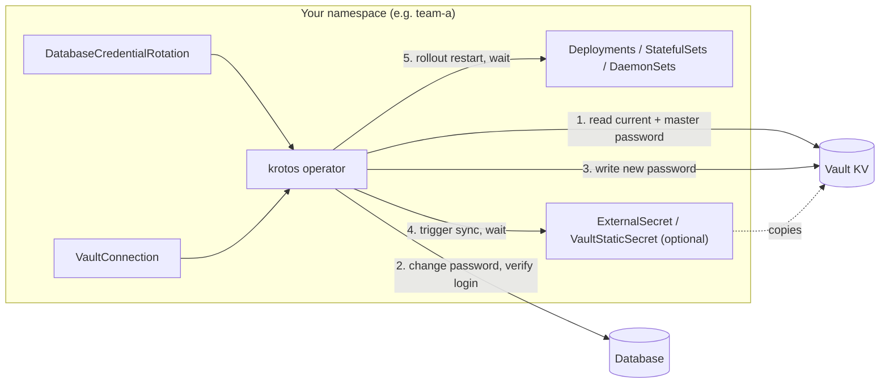
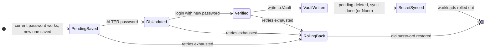

# krotos

**krotos** is a Kubernetes operator that rotates database passwords stored in HashiCorp Vault,
on a schedule and only inside a change window, and then restarts the workloads that use them.

- **Engines:** PostgreSQL, MySQL, MariaDB, ClickHouse, Redis, Valkey, and NATS (`.creds` files of
  JWT/NKey users).
- **Vault:** KV v1 and v2, Kubernetes or token authentication.
- **Delivery to applications:** Vault Agent / CSI (read Vault directly), External Secrets Operator,
  Vault Secrets Operator.
- **Safe by design:** the current password is verified before anything changes, the new one is
  verified before it is published, every step survives an operator restart, a failure rolls the
  database back, and plain passwords never reach Kubernetes objects, logs, events or the database
  server's logs.
- **Namespaced:** one installation per namespace, with a namespaced `Role` only.

```text
$ kubectl get dcr
NAME        ENGINE       USER               PHASE   LAST ROTATION   NEXT                   AGE
analytics   clickhouse   analytics_reader   Idle    3d              2026-10-14T10:02:56Z   10d
billing     mysql        billing_app        Idle    9h              2026-10-08T03:00:00Z   10d
orders      postgresql   orders_app         Idle    5d              2026-11-06T10:02:51Z   10d
```

## Contents

1. [How it works](#1-how-it-works)
2. [Requirements](#2-requirements)
3. [Quick start (local Kind cluster)](#3-quick-start-local-kind-cluster)
4. [Installation](#4-installation)
5. [Vault setup](#5-vault-setup)
6. [Database setup](#6-database-setup)
7. [Your first rotation, step by step](#7-your-first-rotation-step-by-step)
8. [API reference: VaultConnection](#8-api-reference-vaultconnection)
9. [API reference: DatabaseCredentialRotation](#9-api-reference-databasecredentialrotation)
10. [Scheduling and change windows](#10-scheduling-and-change-windows)
11. [The rotation lifecycle](#11-the-rotation-lifecycle)
12. [Delivering the password to applications](#12-delivering-the-password-to-applications)
13. [Restarting workloads](#13-restarting-workloads)
14. [Security model](#14-security-model)
15. [Observability](#15-observability)
16. [Operations](#16-operations)
17. [Troubleshooting](#17-troubleshooting)
18. [Limitations and FAQ](#18-limitations-and-faq)
19. [Development](#19-development)
20. [Roadmap](#20-roadmap)
21. [License](#21-license)

---

## 1. How it works

You describe each database user to rotate in a `DatabaseCredentialRotation` (short name `dcr`).
A `VaultConnection` (short name `vconn`) tells the operator how to reach Vault.



When a rotation is due **and** the change window is open, the operator:

1. Reads the current password of the user from Vault and **logs in with it**. If that fails,
   Vault and the database already disagree and nothing is touched.
2. Generates a new password and stores the old and new password at a *pending* path in Vault,
   so a restarted operator can resume or roll back.
3. Changes the password in the database with the master credentials.
4. **Logs in with the new password.**
5. Writes the new password to Vault (other keys in the secret are kept; with KV v2 the write
   uses check-and-set), then deletes the pending passwords.
6. Optionally makes External Secrets Operator or Vault Secrets Operator copy the new password into
   a Kubernetes Secret, and waits until it did.
7. Restarts the configured workloads like `kubectl rollout restart` and waits for the rollouts.

If steps 3–5 keep failing, the database is put back on the old password. Every step is recorded
in `status.step`; the operator continues where it stopped after a crash or upgrade.

> **There is a short outage window.** Between step 3 and the end of step 7, *new* database
> connections that use the old password are refused (existing connections usually stay open).
> This is why every rotation must define a change window. See
> [Limitations](#18-limitations-and-faq).

---

## 2. Requirements

| Component | Supported | Tested with |
|---|---|---|
| Kubernetes | 1.29+ (CRDs use CEL validation) | 1.37 |
| Helm (to install the chart) | 3.x | 3.17 |
| Vault | KV secrets engine v1 or v2; Kubernetes or token auth | 1.20 |
| PostgreSQL | 10+ (SCRAM-SHA-256) | 17 |
| MySQL | 8.0+ | 8.4 |
| MariaDB | 10.4+, `mysql_native_password` accounts | 11.4 |
| ClickHouse | users managed by SQL (access management) | 25.8 |
| Redis / Valkey | Redis 6+ / Valkey 7+ ACL users; standalone, replicas, Sentinel | Redis 7.4, 8.2; Valkey 8 |
| NATS | 2.10+ in operator (JWT/NKey) mode, any account resolver | 2.10, 2.11, 2.12; nsc 2.15 |
| External Secrets Operator (optional) | `external-secrets.io/v1` | 2.12 |
| Vault Secrets Operator (optional) | `secrets.hashicorp.com/v1beta1` | 1.6 |

The operator must be able to reach Vault and every database over the network, and the rotated
user must be allowed to log in from the operator's pod (the operator verifies logins).

---

## 3. Quick start (local Kind cluster)

The fastest way to see everything working is the development environment. It needs Docker, Go
1.26+, `kubectl` and `helm`.

```sh
make dev-up
```

This creates a Kind cluster `krotos-dev` (on Docker) and installs:

| Namespace | What |
|---|---|
| `krotos-deps` | Vault in dev mode (root token `root`), PostgreSQL 17, MySQL 8.4, ClickHouse 25.8, Redis 8.2 (primary + replica, aclfile), NATS 2.12 (operator mode, full resolver) and `nats-box` with the `nsc` store |
| `external-secrets`, `vault-secrets-operator-system` | External Secrets Operator, Vault Secrets Operator |
| `team-a` | the operator (Helm), `VaultConnection main-vault`, and five demo apps with rotations |

| Rotation | Engine | Application gets the password via | Schedule |
|---|---|---|---|
| `orders` | PostgreSQL | Vault directly (`secretSync: None`) | every 30 days |
| `billing` | MySQL | External Secrets Operator → Secret `billing-db` | daily at 03:00 UTC |
| `analytics` | ClickHouse | Vault Secrets Operator → Secret `analytics-db` | every 7 days |
| `sessions` | Redis, primary + replica, master user from the [least-privilege template](#redis--valkey) | External Secrets Operator → Secret `sessions-redis` | every 7 days |
| `events` | NATS, scoped signing key from the [least-privilege template](#nats) | Vault Secrets Operator → Secret `events-nats`, mounted as `user.creds` | every 7 days, credentials valid 30 days |

The cluster's kubeconfig is written to `bin/krotos-dev.kubeconfig`; your current kubectl
context is **not** changed.

```sh
export KUBECONFIG=$PWD/bin/krotos-dev.kubeconfig
kubectl get vconn,dcr -n team-a

# rotate billing now, regardless of schedule and window
kubectl annotate dcr billing -n team-a \
  krotos.warewave.io/rotate-now=true krotos.warewave.io/ignore-window=true
kubectl get dcr billing -n team-a -w

# the new password, in Vault and in the Secret written by External Secrets Operator
kubectl exec -n krotos-deps deploy/vault -- vault kv get secret/apps/billing/db
kubectl get secret billing-db -n team-a -o jsonpath='{.data.password}' | base64 -d
```

Run `make dev-up` again after code changes (it rebuilds and upgrades the operator and leaves
users and Vault secrets alone). `make dev-down` deletes the cluster. All credentials in
`hack/dev/` are throwaway values for this local cluster.

---

## 4. Installation

### 4.1 Namespaced model

krotos is installed **once per namespace** whose databases it rotates. Each installation:

- watches only its own namespace (`WATCH_NAMESPACE` is the pod's namespace),
- only reads `VaultConnection`s, Secrets and workloads there,
- only restarts workloads there,
- gets its permissions from a namespaced `Role`.

`DatabaseCredentialRotation`s, the `VaultConnection`s they reference, the master-credential
Secrets, the `ExternalSecret`/`VaultStaticSecret`s and the workloads to restart therefore all
live in the same namespace as the operator.

### 4.2 Images and charts

Every release publishes:

| Artifact | Location |
|---|---|
| Image (linux/amd64, linux/arm64) | `ghcr.io/warewave-technology/krotos:<version>` (also `<major>.<minor>` and `latest`) |
| Helm chart | `oci://ghcr.io/warewave-technology/charts/krotos` |
| Single-file manifests | `install.yaml` on the [GitHub Release](https://github.com/Warewave-Technology/krotos/releases) |

To build your own image instead:

```sh
make docker-build docker-push IMG=<registry>/krotos:<tag>
make docker-buildx IMG=<registry>/krotos:<tag>     # linux/amd64 + linux/arm64
```

### 4.3 Install with Helm

```sh
helm install krotos oci://ghcr.io/warewave-technology/charts/krotos --version 0.1.0 \
  --namespace team-a --create-namespace
```

The chart's default image is the published one with the chart's version. From a checkout, use
`dist/chart` instead of the OCI reference; for your own image add
`--set manager.image.repository=<registry>/krotos --set manager.image.tag=<tag>`.

**CRDs are cluster-wide.** The first release installs them (`crd.enabled=true`; with
`crd.keep=true` they survive `helm uninstall`). Install every further namespace with
`--set crd.enabled=false`:

```sh
helm install krotos oci://ghcr.io/warewave-technology/charts/krotos --version 0.1.0 \
  --namespace team-b --create-namespace --set crd.enabled=false
```

**ServiceAccount name.** Vault's Kubernetes auth role must be bound to the operator's
ServiceAccount (see [Vault setup](#5-vault-setup)). Its name is
`<fullname>-controller-manager`, where `<fullname>` is the release name if it contains
`krotos`, otherwise `<release>-krotos`:

| Release name | ServiceAccount |
|---|---|
| `krotos` | `krotos-controller-manager` |
| `team-a-krotos` | `team-a-krotos-controller-manager` |
| `rotator` | `rotator-krotos-controller-manager` |

Check with `kubectl get deploy -n <namespace> -l control-plane=controller-manager -o jsonpath='{.items[0].spec.template.spec.serviceAccountName}'`.

#### Chart values

| Value | Default | Description |
|---|---|---|
| `manager.image.repository` | `ghcr.io/warewave-technology/krotos` | Operator image. |
| `manager.image.tag` | chart `appVersion` | Image tag. |
| `manager.image.pullPolicy` | `IfNotPresent` | |
| `manager.imagePullSecrets` | – | Pull secrets for private registries. |
| `manager.replicas` | `1` | More replicas are fine: leader election (`--leader-elect`) keeps one active. |
| `manager.resources` | 10m/64Mi requests, 500m/128Mi limits | |
| `manager.envOverrides` | `{}` | Extra environment variables, e.g. `HTTPS_PROXY`. |
| `manager.nodeSelector`, `tolerations`, `affinity`, `topologySpreadConstraints`, `priorityClassName` | – | Scheduling. |
| `manager.podSecurityContext`, `securityContext` | non-root, read-only root FS, no capabilities, `RuntimeDefault` seccomp | |
| `serviceAccount.enabled` | `true` | Create the ServiceAccount. If `false`, set `serviceAccount.name`. |
| `serviceAccount.annotations` | – | |
| `crd.enabled` | `true` | Install the CRDs (only in the first release). |
| `crd.keep` | `true` | Keep the CRDs on uninstall. |
| `metrics.enabled` | `true` | Serve Prometheus metrics. |
| `metrics.port` | `8443` | |
| `metrics.secure` | `true` | HTTPS plus Kubernetes authentication/authorization of scrapers. |
| `prometheus.enabled` | `false` | Create a `ServiceMonitor` (needs prometheus-operator). |
| `networkPolicy.enabled` | `false` | Allow ingress to the metrics port only from namespaces labelled `metrics: enabled`. |
| `rbac.helpers.enabled` | `false` | Install admin/editor/viewer roles for the CRDs, for your users. |
| `rbac.namespaced` | `false` | Make those helper roles `Role`s instead of `ClusterRole`s. |

**Cluster-scoped RBAC.** The operator's own permissions are a namespaced `Role`. The only
cluster-scoped objects the chart creates are the CRDs and, with secure metrics, a `ClusterRole`
+ `ClusterRoleBinding` that let the metrics endpoint call TokenReview/SubjectAccessReview, plus a
`metrics-reader` `ClusterRole` for scrapers. With `metrics.secure=false` or
`metrics.enabled=false` the chart creates no `ClusterRole` at all — unless you enable the helper
roles (`rbac.helpers.enabled=true`), which are `ClusterRole`s unless `rbac.namespaced=true`.

### 4.4 Install with plain manifests

The release's `install.yaml` installs the CRDs and the operator into `krotos-system`:

```sh
kubectl apply -f https://github.com/Warewave-Technology/krotos/releases/download/v0.1.0/install.yaml
```

From a checkout: `make deploy IMG=ghcr.io/warewave-technology/krotos:0.1.0` (and
`make undeploy`), or `make build-installer IMG=...` to write `dist/install.yaml`.

### 4.5 Upgrades and uninstall

- Upgrading the operator in the middle of a rotation is safe: the rotation resumes from
  `status.step`.
- Uninstalling while a rotation is in progress is **not**: stop scheduling first
  (`spec.suspend: true` on every rotation), wait until no rotation shows a `status.step`, then
  `helm uninstall`. CRDs are kept (`crd.keep`); delete them manually if you want the resources
  gone everywhere.

---

## 5. Vault setup

### 5.1 Secrets layout

krotos needs two kinds of secrets, both in a KV engine.

**Master credentials** – a user that may change other users' passwords:

```sh
vault kv put secret/db/orders/master username=postgres password='<master password>'
```

(Alternatively from a Kubernetes Secret, see `masterCredentials.secretRef`.)

**The rotated user's secret** – must already exist and contain the **current** password. Other
keys are kept untouched by every rotation:

```sh
vault kv put secret/apps/orders/db username=orders_app password='<current password>' host=pg.db.svc
```

Paths in the CRDs are **inside the mount and without the KV v2 `data/` prefix**:
`mount: secret` + `path: apps/orders/db` is `secret/data/apps/orders/db` in a KV v2 policy.

### 5.2 Policy

KV v2 (mount `secret`):

```hcl
# master credentials
path "secret/data/db/orders/master" {
  capabilities = ["read"]
}
# the rotated user's secret
path "secret/data/apps/orders/db" {
  capabilities = ["read", "create", "update"]
}
# pending passwords of in-flight rotations
path "secret/data/krotos/pending/*" {
  capabilities = ["read", "create", "update"]
}
# destroying every version of a finished rotation's pending secret
path "secret/metadata/krotos/pending/*" {
  capabilities = ["delete"]
}
```

KV v1 (mount `kv`, `kvVersion: 1`) has no `data/` and `metadata/` paths:

```hcl
path "kv/db/orders/master"  { capabilities = ["read"] }
path "kv/apps/orders/db"    { capabilities = ["read", "create", "update"] }
path "kv/krotos/pending/*"  { capabilities = ["read", "create", "update", "delete"] }
```

The pending path is `krotos/pending/<namespace>/<rotation name>` on the **target's** mount, or
`spec.target.vault.pendingPath`. For least privilege, use two `VaultConnection`s: one whose role
can only read master credentials, one that can write the application secrets
(`masterCredentials.vault.connectionRef` and `target.vault.connectionRef` may differ).

### 5.3 Kubernetes auth (recommended)

The operator logs in with its own ServiceAccount token.

```sh
vault auth enable kubernetes

# Vault running inside the same cluster:
vault write auth/kubernetes/config kubernetes_host=https://kubernetes.default.svc:443
# Vault running elsewhere also needs:
#   token_reviewer_jwt=<long-lived token of a SA bound to system:auth-delegator>
#   kubernetes_ca_cert=@ca.crt

vault policy write krotos krotos.hcl
vault write auth/kubernetes/role/krotos \
  bound_service_account_names=krotos-controller-manager \
  bound_service_account_namespaces=team-a \
  token_policies=krotos \
  token_ttl=1h
```

Vault's own ServiceAccount (when Vault runs in the cluster) or the reviewer token needs the
`system:auth-delegator` ClusterRole to validate tokens.

```yaml
apiVersion: krotos.warewave.io/v1alpha1
kind: VaultConnection
metadata:
  name: main-vault
spec:
  address: https://vault.example.com:8200
  auth:
    kubernetes:
      role: krotos
      mountPath: kubernetes   # default
```

**Audience.** If the Vault role sets `audience=...`, set the same `spec.auth.kubernetes.audience`.
The operator then requests a short-lived (10 minute) token for that audience through the
TokenRequest API instead of using its mounted token.

### 5.4 Token auth

```sh
kubectl create secret generic vault-token -n team-a --from-literal=token=<vault token>
```

```yaml
spec:
  address: https://vault.example.com:8200
  auth:
    token:
      secretRef: {name: vault-token, key: token}
```

The token is verified with `auth/token/lookup-self`; a non-expiring token is fine. When you
replace the token in the Secret, the operator logs in again with the new one (the cached session
is keyed by a hash of the token). Use a periodic or long-TTL token and renew it yourself; the
operator does not renew static tokens.

### 5.5 TLS and Vault Enterprise namespaces

```yaml
spec:
  address: https://vault.example.com:8200
  namespace: team-a            # Vault Enterprise namespace
  tls:
    caSecretRef: {name: vault-ca, key: ca.crt}
    # insecureSkipVerify: true   # never in production
```

### 5.6 Checking the connection

```sh
kubectl get vconn -n team-a
NAME         ADDRESS                            READY   AGE
main-vault   https://vault.example.com:8200     True    2m
```

The operator logs in and calls `lookup-self` every 5 minutes (every minute while failing). See
[Troubleshooting](#17-troubleshooting) for `LoginFailed` and `InvalidConfig`.

---

## 6. Database setup

### 6.1 What the operator does on the server

| Engine | Change password | Verify login | What reaches the server |
|---|---|---|---|
| PostgreSQL | `ALTER ROLE "user" WITH PASSWORD 'SCRAM-SHA-256$4096:…'` | `SELECT 1` as the user | A SCRAM-SHA-256 verifier computed by the operator, never the password. |
| MySQL | `ALTER USER 'user'@'host' IDENTIFIED BY '…'` | `SELECT 1` as the user | The password; MySQL masks it in the general, slow and binary logs itself. |
| MariaDB | `ALTER USER 'user'@'host' IDENTIFIED BY PASSWORD '*…'` | `SELECT 1` as the user | A `mysql_native_password` hash. MariaDB does **not** mask `IDENTIFIED BY` in its general log, so the password is never sent. |
| ClickHouse | `ALTER USER user [ON CLUSTER c] IDENTIFIED WITH sha256_hash BY '…' SALT '…'` | `SELECT 1` as the user | A salted SHA-256 hash. |
| Redis / Valkey | `ACL SETUSER user resetpass #<sha256>`, then `ACL SAVE` (or `CONFIG REWRITE`), on every node | `AUTH user password` on every node | The SHA-256 hash. Redis also keeps ACL commands out of `MONITOR`. |
| NATS | Nothing: NATS keeps no users. The operator issues a new user JWT signed by the account signing key. | Connects with the new `.creds` file | Only the connect handshake; the seed signs the server's challenge and is never sent. |

Integration tests check, with statement logging turned on (`log_statement=all`, the general
log, `system.query_log`), that the plain password never appears in the server's logs.

Identifiers are quoted correctly for each engine; user names with quotes, backticks or spaces
work.

### 6.2 Master user privileges

The master user only has to change passwords. Give krotos a dedicated user created from the
templates below instead of an administrator. The templates live in
[`docs/least-privilege/`](docs/least-privilege/) and the integration tests use them verbatim:
they create the user from the template and rotate with it. Replace `krotos_rotator`,
`change-me` and `orders_app`, and store the rotator's username and password as
`masterCredentials`.

The privileges are as narrow as each engine allows; where an engine has no narrower one, the
notes say what else the rotator can do.

#### PostgreSQL

```sql
-- PostgreSQL 16 and later.
CREATE ROLE krotos_rotator LOGIN CREATEROLE PASSWORD 'change-me';
-- ADMIN on the rotated role is what lets the rotator change its password.
-- INHERIT FALSE and SET FALSE keep the rotator from using that role's privileges.
GRANT orders_app TO krotos_rotator WITH ADMIN TRUE, INHERIT FALSE, SET FALSE;
```

- Repeat the `GRANT` for every rotated role. The rotator cannot change roles it holds no
  `ADMIN` on, the master included (tested).
- `INHERIT FALSE, SET FALSE` keep it from using the rotated role's privileges.
- Before PostgreSQL 16, `CREATEROLE` alone lets a role change the password of any role that is
  not a superuser.

#### MySQL

```sql
-- MySQL 8.0 and later.
CREATE USER 'krotos_rotator'@'%' IDENTIFIED BY 'change-me';
GRANT CREATE USER ON *.* TO 'krotos_rotator'@'%';
```

- `CREATE USER` is global: the rotator can change any account that lacks `SYSTEM_USER`.
  Accounts holding `SYSTEM_USER`, such as `root` in MySQL 8, stay out of its reach (tested).
  Never grant the rotator `SYSTEM_USER`.
- It needs no privilege on the application's database: the operator connects without selecting
  one.

#### MariaDB

```sql
-- MariaDB 10.4 and later.
CREATE USER 'krotos_rotator'@'%' IDENTIFIED BY 'change-me';
GRANT CREATE USER ON *.* TO 'krotos_rotator'@'%';
-- Only these columns: enough to check the account's authentication plugin,
-- without access to password hashes.
GRANT SELECT (User, Host, plugin) ON mysql.user TO 'krotos_rotator'@'%';
```

- The column privilege lets it read an account's authentication plugin, not password hashes
  (tested).
- MariaDB has no `SYSTEM_USER`: with `CREATE USER` the rotator can change any account, `root`
  included. Protect its credentials like an administrator's.

#### ClickHouse

```sql
-- ClickHouse, SQL-managed users.
CREATE USER krotos_rotator IDENTIFIED WITH sha256_password BY 'change-me';
GRANT ALTER USER ON *.* TO krotos_rotator;
```

- `ALTER USER ON *.*` covers every SQL-managed user. Users defined in `users.xml` cannot be
  changed through SQL by anyone.
- With `spec.database.clickhouse.cluster`, also `GRANT CLUSTER ON *.* TO krotos_rotator;` (not
  covered by the tests).

#### Redis / Valkey

```text
ACL SETUSER krotos_rotator on >change-me resetkeys resetchannels -@all +ping +config|get +acl|setuser +acl|save
```

With `persistence: ConfigRewrite`, also:

```text
ACL SETUSER krotos_rotator +info +config|rewrite
```

- Create the rotator on every server in `database.redis.nodes` too, and persist it (`ACL SAVE`
  or `CONFIG REWRITE`).
- It cannot read or write data (tested: `NOPERM`).
- `acl|setuser` lets it change any user's rules, its own included; Redis has no narrower
  permission, so in practice this is administrative access. Protect its credentials like an
  administrator's.

#### NATS

NATS has no users to alter: the "master credentials" are an account **signing key**, which
krotos uses to issue the user's new JWT. Give krotos a key of its own, scoped to a role, so
that every user it signs gets the role's permissions and nothing more:

```sh
# nsc 2.x, run against the store that holds the account's keys.
# ORDERS is the rotated user's account; replace the names and permissions.

# A signing key that only krotos uses, scoped to a role: every user it signs gets
# exactly the role's permissions, so krotos cannot issue users with more.
nsc generate nkey --account > krotos-orders.nk   # line 1: seed, line 2: public key
sed -n 1p krotos-orders.nk > krotos-orders.seed
nsc edit account --name ORDERS --sk "$(sed -n 2p krotos-orders.nk)"
nsc edit signing-key --account ORDERS --sk "$(sed -n 2p krotos-orders.nk)" --role krotos-orders \
  --allow-pub "orders.>" --allow-sub "orders.>,_INBOX.>"

# The user, signed by that key; krotos keeps reissuing it with the same name.
nsc add user --account ORDERS --name orders-service -K krotos-orders.seed --expiry 60d
nsc generate creds --account ORDERS --name orders-service > orders-service.creds

# Publish the changed account to the servers (full or URL resolver).
nsc push --account ORDERS
```

- Set the role's permissions to what the application needs; krotos keeps reissuing the user
  with the same name, and the server applies the role.
- Store the seed (`krotos-orders.seed`, `SA…`) as the master credentials, e.g.
  `vault kv put secret/nats/orders/signing-key seed=@krotos-orders.seed`, with
  `masterCredentials.vault.passwordKey: seed`. No username is needed. Store
  `orders-service.creds` as the target (`target.vault.passwordKey: creds`). Then delete the
  local key files.
- An **existing** user must be reissued with the scoped key: users signed by a scoped key must
  not carry permissions of their own, and the server refuses them otherwise (tested). Remove its
  permissions and sign it again with `-K krotos-orders.seed`, or add it anew as above.
- With the memory resolver, regenerate the server configuration instead of `nsc push`.
- The key can issue users with **any** name in the account, all limited to the role. Protect its
  seed accordingly.

### 6.3 The rotated user

- It must exist, and the password in Vault must be its **current** password.
- It must be able to log in to `spec.database.database` (Redis: the server) **from the operator's pod**:
  `pg_hba.conf`, MySQL host patterns, network policies and grants all apply (MySQL needs at
  least one privilege on the database to select it, ClickHouse needs a grant on it).
- **PostgreSQL:** the stored password becomes a SCRAM verifier. Clients must support SCRAM
  (all drivers since PostgreSQL 10 do). `pg_hba.conf` lines with method `md5` keep working:
  PostgreSQL uses SCRAM automatically for SCRAM-stored passwords. Lines with method `password`
  send the password in plain text and should be avoided anyway.
- **MySQL:** `spec.target.mysqlHost` selects the account's host part (`'orders_app'@'%'` by
  default). Accounts with the same user name and another host are not changed.
- **MariaDB:** only `mysql_native_password` accounts (MariaDB's default). For accounts using
  `ed25519` or other plugins the operator refuses to send the password, because MariaDB would
  write it to the general log; the attempt ends as `RolledBack` with the database unchanged and
  a message naming the plugin.
- **ClickHouse:** only users created with SQL (`CREATE USER`) can be rotated. Users from
  `users.xml` / `users.d` fail with *"… storage is readonly"*. The new hash replaces **all** of
  the user's authentication methods. For a cluster whose access storage is not replicated, set
  `spec.database.clickhouse.cluster` so the statement runs `ON CLUSTER`.
- **Redis / Valkey:** ACL users of Redis 6+ and Valkey; use `default` for a server that only
  has `requirepass`. Only the user's passwords are replaced; its other ACL rules stay. The login
  check sends nothing but `AUTH`, so the user needs no other command.
  - **Persistence.** ACL changes live in memory; a restarted server would come back with the
    old password while Vault holds the new one. `spec.database.redis.persistence` decides:

    | Value | Behavior |
    |---|---|
    | `Auto` (default) | `ACL SAVE` when the server has an `aclfile`; otherwise the rotation is refused before anything changes. |
    | `ACLFile` | `ACL SAVE`; refused when there is no `aclfile`. |
    | `ConfigRewrite` | `CONFIG REWRITE`; refused when the server has no config file. |
    | `None` | In memory only; the old password returns after a restart. For pure caches. |

    `Auto` never chooses `CONFIG REWRITE`: it rewrites the whole config file, including runtime
    `CONFIG SET` changes and command-line arguments. With the official Redis 8 image it writes
    the bundled modules into the file, and the server no longer starts (found in testing).
    Prefer an `aclfile`.
  - **Replicas and Sentinel.** ACL changes are not replicated (tested): list every server in
    `spec.database.redis.nodes`. The password is changed, persisted and verified on each.
  - **Not supported yet:** Redis Cluster, and managed services (ElastiCache, MemoryDB, Azure
    Cache for Redis, Memorystore), which manage users through their own APIs.
- **NATS:** users of a server in operator (JWT/NKey) mode. Users defined in the server's config
  file (`user`/`password`, `nkey`) are not supported.
  - **What is rotated.** The target secret holds the whole `.creds` file (user JWT and NKey
    seed) under `target.vault.passwordKey`. The JWT's name must equal `target.username`. Each
    rotation issues a new user: a new NKey, and a JWT with the current one's name, permissions,
    limits and tags, expiring after `database.nats.credentialsTTL`. `passwordPolicy` and
    `database.database` are not used.
  - **How the old credentials stop working.** NATS accepts every unexpired JWT signed by the
    account, so the old credentials stay valid **until they expire**; the server then refuses
    them and drops their connections (tested). Revocation is not implemented yet.
  - **The TTL.** `credentialsTTL` must be at least twice the longest time between two rotations
    under the schedule and window, so that one failed rotation does not let the credentials in
    use expire; otherwise the spec is refused (`Ready=False`, `InvalidSpec`). `every: 7d` with a
    daily window needs at least `336h`. Watch `status.credentialsExpireTime` and the
    `krotos_credentials_expiry_timestamp_seconds` metric ([15.3](#153-suggested-alerts)).
  - **Already expired credentials** do not stop a rotation: applications cannot connect anyway,
    and new credentials are the fix. The rotation goes on with a `CredentialsExpired` warning.
  - **Nothing is changed on the server**, so any account resolver works and a rollback has
    nothing to undo. The account JWT on the servers must list the signing key (`nsc push`).
  - **Applications** read the file: mount the synced Secret's key as a file, or read it from
    Vault.

    ```yaml
    volumes:
    - name: nats-creds
      secret:
        secretName: orders-nats
        items: [{key: creds, path: user.creds}]
    ```

### 6.4 TLS to the database

`spec.database.tls.mode` (default `require`):

| Mode | Encryption | Verifies certificate chain | Verifies host name |
|---|---|---|---|
| `disable` | no | – | – |
| `require` (default) | yes | no | no |
| `verify-ca` | yes | yes (`caSecretRef` required) | no |
| `verify-full` | yes | yes (`caSecretRef` required) | yes (`spec.database.host`) |

The same semantics apply to all engines. Without TLS the MySQL driver still never sends the
password in clear text (cleartext auth plugins are disabled).

---

## 7. Your first rotation, step by step

Example: PostgreSQL user `orders_app`, application `orders-api` that reads Vault through the
Vault Agent injector, namespace `team-a`.

1. **Install the operator** in `team-a` ([Installation](#4-installation)).
2. **Prepare Vault** ([Vault setup](#5-vault-setup)): master credentials at
   `secret/db/orders/master`, the user's current password at `secret/apps/orders/db`, the
   policy, and the Kubernetes auth role bound to the operator's ServiceAccount.
3. **Check the database** ([Database setup](#6-database-setup)): the master user may change
   `orders_app`'s password, and `orders_app` can log in from the operator's pod.
4. **Create the VaultConnection** and wait for `READY=True`:

   ```sh
   kubectl apply -n team-a -f - <<'EOF'
   apiVersion: krotos.warewave.io/v1alpha1
   kind: VaultConnection
   metadata:
     name: main-vault
   spec:
     address: https://vault.example.com:8200
     auth:
       kubernetes:
         role: krotos
   EOF
   kubectl get vconn -n team-a -w
   ```

5. **Create the rotation, suspended**, so nothing happens yet:

   ```sh
   kubectl apply -n team-a -f - <<'EOF'
   apiVersion: krotos.warewave.io/v1alpha1
   kind: DatabaseCredentialRotation
   metadata:
     name: orders
   spec:
     suspend: true
     engine: postgresql
     database:
       host: orders-pg.databases.svc
       port: 5432
       database: orders
       tls:
         mode: verify-full
         caSecretRef: {name: orders-pg-ca, key: ca.crt}
     masterCredentials:
       vault: {connectionRef: main-vault, path: db/orders/master}
     target:
       username: orders_app
       vault: {connectionRef: main-vault, path: apps/orders/db}
     schedule:
       every: 30d
     window:
       timezone: Europe/Istanbul
       days: [Sat, Sun]
       start: "02:00"
       duration: 3h
     restartTargets:
     - kind: Deployment
       name: orders-api
   EOF
   ```

6. **Check that it is valid:** `kubectl get dcr orders -n team-a -o yaml` should show the
   condition `Ready=True` (reason `SpecValid`). Invalid time zones, cron expressions etc. show
   `Ready=False` with reason `InvalidSpec`.
7. **Unsuspend it.** With `every`, a rotation that never ran is due immediately: it starts right
   away if a window is open with at least `minRemaining` left, otherwise at the next window
   opening (phase `Waiting` until then):

   ```sh
   kubectl patch dcr orders -n team-a --type=merge -p '{"spec":{"suspend":false}}'
   ```

   To try it right now instead:

   ```sh
   kubectl annotate dcr orders -n team-a \
     krotos.warewave.io/rotate-now=true krotos.warewave.io/ignore-window=true
   ```

8. **Watch it:**

   ```sh
   kubectl get dcr orders -n team-a -w
   kubectl get events -n team-a --field-selector involvedObject.name=orders
   ```

   You will see `Rotating` → `Restarting` → `Idle`, `LAST ROTATION` set, and the events
   `RotationStarted`, `RestartingWorkloads`, `RotationSucceeded`.

More complete examples, including every field, are in [`config/samples/`](config/samples/):
a full PostgreSQL reference, MySQL with External Secrets Operator and a Secret for the master
credentials, ClickHouse on a cluster with Vault Secrets Operator.

---

## 8. API reference: VaultConnection

`apiVersion: krotos.warewave.io/v1alpha1`, `kind: VaultConnection`, short name `vconn`.

> Vault Secrets Operator also has a kind named `VaultConnection`. When both are installed, use
> `kubectl get vconn` or `kubectl get vaultconnections.krotos.warewave.io`.

### Spec

| Field | Type | Required | Default | Description |
|---|---|---|---|---|
| `address` | string | yes | | Vault address; must start with `http://` or `https://`. |
| `namespace` | string | | | Vault Enterprise namespace. |
| `tls.caSecretRef.name` / `.key` | string | | | Secret key with a PEM CA bundle for Vault's certificate. |
| `tls.insecureSkipVerify` | bool | | `false` | Skip certificate verification. |
| `auth.kubernetes.role` | string | one of `kubernetes`/`token` | | Vault role for the Kubernetes auth method. |
| `auth.kubernetes.mountPath` | string | | `kubernetes` | Mount path of the Kubernetes auth method. |
| `auth.kubernetes.audience` | string | | | Audience to request a token for; empty uses the pod's mounted token. |
| `auth.token.secretRef.name` / `.key` | string | one of `kubernetes`/`token` | | Secret key holding a Vault token. |

Validation: exactly one of `auth.kubernetes` and `auth.token`.

### Status

| Field | Description |
|---|---|
| `conditions[type=Ready]` | `True`/`Authenticated` when login and `lookup-self` succeed; `False`/`InvalidConfig` when the configuration cannot be used (e.g. a referenced Secret or key is missing); `False`/`LoginFailed` when Vault rejects the login or is unreachable. The message explains why and never contains secrets. |
| `lastCheckedTime` | Time of the last check. |
| `observedGeneration` | Last reconciled `metadata.generation`. |

`kubectl get vconn` columns: `ADDRESS`, `READY`, `AGE`.

---

## 9. API reference: DatabaseCredentialRotation

`apiVersion: krotos.warewave.io/v1alpha1`, `kind: DatabaseCredentialRotation`, short name `dcr`.
One object rotates the password of **one** database user.

### 9.1 Spec

#### Top level

| Field | Type | Required | Default | Description |
|---|---|---|---|---|
| `engine` | `postgresql` \| `mysql` \| `clickhouse` \| `redis` \| `nats` | yes | | Use `mysql` for MariaDB and `redis` for Valkey. |
| `suspend` | bool | | `false` | Stop starting new rotations. A rotation in progress is finished. |
| `database` | object | yes | | See below. |
| `masterCredentials` | object | yes | | See below. |
| `target` | object | yes | | See below. |
| `passwordPolicy` | object | | `{length: 32}` | See below. |
| `schedule` | object | yes | | See below. |
| `window` | object | yes | | See below. |
| `secretSync` | object | | `{type: None, timeout: 5m}` | See below. |
| `restartTargets` | list (max 32) | | | Workloads to restart. See below. |
| `rolloutTimeout` | duration | | `10m` | How long to wait for restarted workloads to roll out. |

#### `database`

| Field | Type | Required | Default | Description |
|---|---|---|---|---|
| `host` | string | yes | | Host name or IP. |
| `port` | int (1–65535) | yes | | |
| `database` | string | | | Database to connect to. When empty: PostgreSQL connects to the database named like the user, MySQL connects without selecting one, ClickHouse uses `default`. Set it explicitly. |
| `tls.mode` | `disable` \| `require` \| `verify-ca` \| `verify-full` | | `require` | See [TLS to the database](#64-tls-to-the-database). The whole `tls` block defaults to `{mode: require}`. |
| `tls.caSecretRef.name` / `.key` | string | for `verify-ca`, `verify-full` | | PEM CA bundle. |
| `clickhouse.cluster` | string | | | Run `ALTER USER … ON CLUSTER <cluster>`. Only allowed with `engine: clickhouse`. |
| `clickhouse.protocol` | `native` \| `http` | | `native` | Use the port that matches the protocol (native 9000/9440, HTTP 8123/8443). |
| `redis.persistence` | `Auto` \| `ACLFile` \| `ConfigRewrite` \| `None` | | `Auto` | How the change survives a restart; see [6.3](#63-the-rotated-user). Only allowed with `engine: redis`. |
| `redis.nodes` | list of `host:port` (max 16) | | | Further servers that get the same change, such as replicas. |
| `nats.credentialsTTL` | duration | with `engine: nats` | | How long issued credentials stay valid; at least twice the longest time between two rotations. Required with `engine: nats`, and only allowed then. |

#### `masterCredentials` (exactly one of `vault` or `secretRef`)

| Field | Type | Required | Default | Description |
|---|---|---|---|---|
| `vault.connectionRef` | string | yes | | Name of a `VaultConnection` in the namespace. |
| `vault.mount` | string | | `secret` | KV mount. |
| `vault.path` | string | yes | | Path inside the mount, without `data/`. |
| `vault.kvVersion` | `1` \| `2` | | `2` | |
| `vault.usernameKey` | string | | `username` | |
| `vault.passwordKey` | string | | `password` | |
| `secretRef.name` | string | yes | | Kubernetes Secret in the namespace. |
| `secretRef.usernameKey` | string | | `username` | |
| `secretRef.passwordKey` | string | | `password` | |

The master credentials are read at every reconcile of an in-flight rotation; nothing is cached
on disk. The master password itself is never rotated by krotos. For NATS the password key holds
the account signing key's seed and no username is needed.

#### `target`

| Field | Type | Required | Default | Description |
|---|---|---|---|---|
| `username` | string | yes | | The database user to rotate. |
| `mysqlHost` | string | | `%` | Host part of the MySQL/MariaDB account. Only allowed with `engine: mysql`. |
| `vault.connectionRef` | string | yes | | `VaultConnection` that can read and write the secret (and the pending path). |
| `vault.mount` | string | | `secret` | |
| `vault.path` | string | yes | | The user's secret; must exist and hold the current password. |
| `vault.kvVersion` | `1` \| `2` | | `2` | |
| `vault.passwordKey` | string | | `password` | Key the password is read from and written to (NATS: the `.creds` file). |
| `vault.usernameKey` | string | | | When set, this key is also written with `username` on every rotation. |
| `vault.pendingPath` | string | | `krotos/pending/<namespace>/<name>` | Where in-flight rotations keep their passwords (same mount and KV version). |

#### `passwordPolicy`

| Field | Type | Default | Description |
|---|---|---|---|
| `length` | int (16–128) | `32` | |
| `excludeCharacters` | string | `` ' " \ ` $ @ : / ? # % & `` | Characters never used. The default removes characters that commonly break connection strings, shells and SQL quoting. |

Passwords are drawn with `crypto/rand` from printable ASCII (`!`–`~`) minus the excluded
characters, and always contain at least one lower-case letter, upper-case letter and digit, and
one symbol if any symbol remains allowed.

An empty `excludeCharacters` means the default set; there is no way to allow every character.
Excluding all letters of a case or all digits is not caught by the API server: each attempt
then fails with *"Generating password: …"* (`Rotated=False`, `RotationFailed`), after the
current-password check and before anything is changed.

#### `schedule` (exactly one of `cron` or `every`)

| Field | Type | Description |
|---|---|---|
| `cron` | string | Standard 5-field cron expression or descriptor (`@daily`, `@weekly`, …), evaluated in `window.timezone`. `TZ=`/`CRON_TZ=` prefixes are rejected. |
| `every` | string | `<N>d` or `<N>h` (e.g. `30d`, `12h`), counted from the last **successful** rotation. |

#### `window` (required)

| Field | Type | Required | Default | Description |
|---|---|---|---|---|
| `timezone` | IANA zone name | | `UTC` | E.g. `Europe/Istanbul`. The time zone database is built into the operator. |
| `days` | list of `Mon`…`Sun` | | every day | Days on which the window **opens**. |
| `start` | `HH:MM` | yes | | Local opening time. |
| `duration` | duration | yes | | Greater than 0, at most `24h`. |
| `minRemaining` | duration | | `15m` | A rotation only starts if at least this much of the window is left. Must be shorter than `duration`. |

#### `secretSync`

| Field | Type | Default | Description |
|---|---|---|---|
| `type` | `None` \| `ExternalSecret` \| `VaultStaticSecret` | `None` | How applications receive the password. See [Delivering the password](#12-delivering-the-password-to-applications). |
| `externalSecret.name` | string | | The `ExternalSecret`. Required for, and only allowed with, `type: ExternalSecret`. |
| `externalSecret.secretName` | string | | The Secret it writes. |
| `externalSecret.secretKey` | string | `target.vault.passwordKey` | Key in that Secret holding the plain password. Both sync operators copy Vault's keys as they are, so the default fits unless the Secret is templated. |
| `vaultStaticSecret.*` | | | Same fields, for `type: VaultStaticSecret`. |
| `timeout` | duration | `5m` | How long to wait for the Secret to hold the new password. |

#### `restartTargets[]` (each with exactly one of `name` or `selector`)

| Field | Type | Description |
|---|---|---|
| `kind` | `Deployment` \| `StatefulSet` \| `DaemonSet` | |
| `name` | string | A single workload. |
| `selector` | label selector | All workloads of that kind matching `matchLabels`/`matchExpressions`. |

#### Validation summary

The API server rejects:

- both or neither of `schedule.cron` / `schedule.every`; `every` not matching `^[1-9][0-9]*(d|h)$`;
- both or neither of `masterCredentials.vault` / `masterCredentials.secretRef`;
- `window.duration` ≤ 0 or > 24h; `window.start` not `HH:MM`; `minRemaining` < 0 or ≥ `duration`;
- `database.clickhouse` unless `engine: clickhouse`; `database.redis` unless `engine: redis`;
  `target.mysqlHost` unless `engine: mysql`; an unknown `database.redis.persistence`;
  `database.nats` missing with `engine: nats`, or set with another engine;
- `tls.mode` `verify-ca`/`verify-full` without `caSecretRef`;
- `secretSync.externalSecret`/`vaultStaticSecret` missing for, or set without, the matching `type`;
- a restart target with both or neither of `name` / `selector`;
- `kvVersion` other than 1 or 2; `passwordPolicy.length` outside 16–128.

Checked by the operator (reported as `Ready=False`, reason `InvalidSpec`): unknown time zone,
invalid cron expression, a `nats.credentialsTTL` shorter than twice the longest time between two
rotations.

### 9.2 Annotations

| Annotation | Effect |
|---|---|
| `krotos.warewave.io/rotate-now: "true"` | Makes the rotation due now. It still waits for the window. |
| `krotos.warewave.io/ignore-window: "true"` | Lets a **due** rotation start outside the window (and ignores `minRemaining`). It does not make a rotation due by itself. |

Both are **one-shot**: the operator removes them after the attempt, whether it succeeded or
failed. Use both together for "rotate right now". Annotations added while a rotation is already
in progress are removed when that rotation ends; they do not trigger another attempt.

### 9.3 Status

| Field | Description |
|---|---|
| `phase` | `Idle` (not due, or done), `Waiting` (due, waiting for the window), `Rotating` (changing the password, or waiting for the secret sync), `Restarting` (waiting for rollouts), `Failed` (the last attempt failed; stays until the next attempt starts, including while waiting for the back-off, the window, or while suspended). |
| `step` | Last completed step of the rotation in progress: `PendingSaved`, `DbUpdated`, `Verified`, `VaultWritten`, `SecretSynced`, `RollingBack`. Empty when no rotation is in progress. |
| `retries` | Failed attempts of the current step. |
| `lastRotationTime` | When the last rotation completed successfully. |
| `lastAttemptTime` | When the last rotation started. |
| `nextScheduledTime` | When the next rotation becomes (or became) due. |
| `nextWindowStart` | When the next rotation can start (window opening, or end of a failure back-off). |
| `consecutiveFailures` | Failed attempts since the last success. |
| `secretSyncStartTime` | When the in-flight rotation triggered the secret sync. |
| `rolloutStartTime` | When the in-flight rotation started restarting workloads. |
| `credentialsExpireTime` | When the credentials issued by the last rotation expire (NATS only). |
| `message` | Human-readable state. Never contains secrets. |
| `observedGeneration` | |
| `conditions` | See below. |

#### Conditions

| Type | Status / Reason | Meaning |
|---|---|---|
| `Ready` | `True` / `SpecValid` | The spec can be used. |
| | `False` / `InvalidSpec` | Unknown time zone, invalid cron expression, or a NATS credentials TTL that is too short. No rotation starts. |
| | `False` / `EngineNotSupported` | The engine is not available in this operator build. |
| `Rotated` | `True` / `RotationSucceeded` | The last attempt rotated the password. |
| | `False` / `RotationFailed` | The last attempt failed before anything was changed. |
| | `False` / `RolledBack` | The last attempt failed after changing the database; the old password was restored. |
| `Degraded` | `False` / `AsExpected` | Nothing needs attention. |
| | `True` / `RotationStuck` | A rollback keeps failing, or the in-flight state is lost: the database and Vault may disagree. **Act now.** |
| | `True` / `RolloutIncomplete` | The password was rotated, but the secret sync or some restarts did not complete. Workloads may still use the old password. Cleared by the next attempt, whatever its outcome. |

`kubectl get dcr` columns: `ENGINE`, `USER`, `PHASE`, `LAST ROTATION`, `NEXT`
(`nextScheduledTime`), `AGE`.

---

## 10. Scheduling and change windows

### 10.1 When is a rotation due?

| Schedule | Never rotated | After a successful rotation at *T* |
|---|---|---|
| `every: 30d` | due immediately | due at *T* + 30 days |
| `cron: "0 3 * * 6"` | first cron time after the object was created | first cron time after *T* |

A failed attempt does **not** move the due time: the rotation stays due and is retried.
`rotate-now` makes it due at once.

### 10.2 When does a due rotation start?

When **all** of these hold:

1. `spec.suspend` is `false`;
2. the `Ready` condition is `True`;
3. a window is open **and** at least `minRemaining` of it is left — or `ignore-window` is set;
4. no failure back-off is running (see below).

Otherwise the status shows phase `Waiting` (due) or `Idle` (not due) and `nextWindowStart`.

A rotation that has started always runs to the end, even if the window closes in the meantime.
`minRemaining` (default 15 minutes) keeps it from starting just before the window closes.

### 10.3 Window semantics

- A window belongs to the **day it opens**. `days: [Sat]`, `start: "23:00"`, `duration: 3h`
  lasts from Saturday 23:00 to Sunday 02:00.
- The opening is included, the closing is not (`[start, start + duration)`).
- `days` empty means every day; `duration: 24h` with `start: "00:00"` is open around the
  clock — but a rotation still cannot *start* in the last `minRemaining` before each midnight,
  and on DST change days the 24 absolute hours leave a one-hour gap or overlap.
- Times are local to `timezone`, including daylight saving time:
  - **Spring forward:** a `start` that does not exist that day (e.g. 02:30 when clocks jump
    from 02:00 to 03:00) opens one hour later (03:30).
  - **Fall back:** windows keep their local start time; the day they open on is 25 hours long.
    Avoid a `start` inside the repeated hour, where the opening instant is ambiguous.
- A missed cron time is caught up at the next window, even if that window is on a day the cron
  expression does not match. Example: `cron: "0 3 * * 6"` with windows on `[Sat, Sun]` – if
  Saturday's window passes without a rotation, it runs Sunday.

### 10.4 Failures and back-off

After a failed attempt (status `Failed`, `consecutiveFailures` > 0) the next attempt waits
**5 minutes × 2^(failures−1)**, at most **6 hours**, counted from the **start** of the failed
attempt (`lastAttemptTime`): 5m, 10m, 20m, 40m, 80m, 160m, 320m, 6h, …, and then for an open
window. `ignore-window` skips the window wait, not the back-off. A success
resets the counter.

### 10.5 Suspending

`spec.suspend: true` prevents new rotations (the status message says `Suspended`; the phase is
`Idle`, or stays `Failed` if the last attempt failed). A rotation in progress is finished. Unsuspend to resume normal scheduling; a rotation that became due while
suspended starts at the next window.

---

## 11. The rotation lifecycle

### 11.1 Steps



| `status.step` after | What happened | If the operator dies here |
|---|---|---|
| *(empty)* | Nothing yet. Start: read the current password from Vault, log in with it, generate a new password, save old+new at the pending path. | Restarts from the beginning with a new password; nothing was changed. |
| `PendingSaved` | Old and new password are in Vault's pending path. Next: change the password in the database. | `ALTER` is repeated with the same pending password (idempotent). |
| `DbUpdated` | The database has the new password. Next: log in with it. | Login is repeated. |
| `Verified` | The new password works. Next: write it to Vault. | The write is repeated; if Vault already has it, that is detected. |
| `VaultWritten` | Database and Vault hold the new password. Next: delete the pending passwords, trigger and wait for the secret sync. | Continues the sync. |
| `SecretSynced` | Applications can get the new password. Next: restart workloads and wait. | Continues; each workload is restarted only once per rotation. |
| `RollingBack` | Restoring the old password. | The rollback is retried. |

### 11.2 Checks before anything changes

At the start of every attempt:

- the user's secret must exist in Vault and contain a string at `passwordKey`;
- **that password must log in to the database.**

Otherwise the attempt fails with nothing changed (`Rotated=False`, reason `RotationFailed`).
Typical message: *"The current password in Vault does not work for "orders_app", not rotating"*.
This protects against rotating a user whose Vault entry is already wrong.

One exception: NATS credentials that are valid but **expired**. Applications cannot connect
with them anyway and new credentials are what fixes that, so the rotation goes on with a
`CredentialsExpired` warning event. For NATS, the current credentials must also belong to
`target.username`.

### 11.3 Retries and rollback

| Step | Attempts | Back-off between attempts | When attempts are exhausted |
|---|---|---|---|
| Change the password in the database | 3 | 15s, 30s | roll back |
| Log in with the new password | 3 | 15s, 30s | roll back |
| Write to Vault | 5 | 15s, 30s, 1m, 2m | roll back — unless Vault turns out to already hold the new password (a write whose response was lost), then continue |
| Roll back | unlimited | 15s doubling up to 5m | `Degraded=True` / `RotationStuck` until it succeeds |

The Vault write reads the secret, replaces `passwordKey` (and `usernameKey`) and writes it back,
so other keys are kept. With **KV v2** the write uses check-and-set against the version just
read: a concurrent change makes it retry instead of overwriting the change. **KV v1** has no
check-and-set; a change to the same secret made between the read and the write is lost.

A rollback first tries to log in with the old password. If that works, the database was never
changed (for example the master user lacks the privilege, so every `ALTER` failed) and nothing
needs undoing. Otherwise it runs `ALTER` with the old password and verifies a login with it.
Afterwards the attempt counts as failed (`Rotated=False`, reason `RolledBack`, the message ends
with the original error), the pending passwords are deleted, and the normal failure back-off
applies.

### 11.4 Where the in-flight passwords live

During a rotation the old and new password are needed to resume or roll back. They are kept:

1. **In Vault**, at the pending path (`krotos/pending/<namespace>/<name>` by default), under the
   same mount, KV version and `VaultConnection` as the target. Access is governed by your Vault
   policy. As soon as the new password is in Vault (step `VaultWritten`), the pending secret is
   deleted — for KV v2 its metadata is deleted, which destroys **every version**.
2. **In the operator's memory**, so that a rollback also works while Vault is unreachable, as
   long as the operator is not restarted at the same time.

They are **never** stored in a Kubernetes Secret, ConfigMap, status, event or log.

### 11.5 Deleting a rotation

`DatabaseCredentialRotation`s carry the finalizer `krotos.warewave.io/rotation`. Deleting one
while a rotation is in progress waits until that rotation has finished (or rolled back); no new
rotation starts. When nothing is in progress the object is removed at once.

### 11.6 Concurrency

The rotation controller handles one reconcile at a time: the database and Vault steps of
different rotations never run in parallel. Those steps run within a single reconcile; database
connections time out after 10 seconds and Vault calls after 30 seconds. Waiting for a secret
sync or rollouts is done by polling (every 5s and 10s) rather than blocking, so several
rotations can be in those phases at the same time. `VaultConnection` checks run in their own
controller.

---

## 12. Delivering the password to applications

Set `spec.secretSync.type` according to how your application gets the password.

### 12.1 `None` – the application reads Vault itself

Vault Agent injector, the Vault CSI provider, or the application's own Vault client. After the
Vault write the operator restarts the workloads right away; the restarted pods read the new
password from Vault.

### 12.2 `ExternalSecret` – External Secrets Operator

```yaml
secretSync:
  type: ExternalSecret
  externalSecret:
    name: orders-db        # the ExternalSecret
    secretName: orders-db  # the Secret it writes (spec.target.name of the ExternalSecret)
    secretKey: password    # key in that Secret holding the plain password (default: target.vault.passwordKey)
  timeout: 5m
```

The operator sets ESO's `force-sync` annotation on the ExternalSecret (once per rotation), then
polls the Secret until `secretKey` equals the new password in Vault.

### 12.3 `VaultStaticSecret` – Vault Secrets Operator

```yaml
secretSync:
  type: VaultStaticSecret
  vaultStaticSecret:
    name: orders-db        # the VaultStaticSecret
    secretName: orders-db  # its spec.destination.name
    secretKey: password
  timeout: 5m
```

Vault Secrets Operator has no documented force-sync annotation, but it reconciles on any
annotation change and re-reads Vault when it does. The operator sets
`krotos.warewave.io/sync-requested-at` (once per rotation) and polls the Secret the same way.

### 12.4 Rules for both sync types

- Workloads are restarted **only after** the Secret holds the new password. Restarting earlier
  would start them with the old one.
- If the Secret does not hold it within `timeout`, or the `ExternalSecret`/`VaultStaticSecret`
  (or its CRD) does not exist, the rotation **completes** (database and Vault already have the
  new password), is marked `Degraded=True` / `RolloutIncomplete`, and **no workload is
  restarted**. Running pods keep their existing connections; fix the sync, then restart them
  yourself (`kubectl rollout restart`).
- `secretKey` must contain **the password itself**. If your ExternalSecret templates the value
  (e.g. into a DSN), the comparison never matches.
- Do not let the sync operator or another tool also restart the same workloads (VSO
  `rolloutRestartTargets`, Stakater Reloader, …), or they restart twice.
- The ExternalSecret / VaultStaticSecret is handled generically (no dependency on ESO/VSO
  libraries); the operator needs `get` and `patch` on them, which the chart grants.

---

## 13. Restarting workloads

Each `restartTargets` entry selects Deployments, StatefulSets or DaemonSets in the namespace, by
`name` or label `selector`. Duplicates are restarted once.

**How.** Like `kubectl rollout restart`: the operator sets the pod template annotation
`krotos.warewave.io/restartedAt` to the rotation's start time. A workload that already carries
that value is not patched again, so an operator restart never causes a second restart.

**When a rollout counts as complete** (same rules as `kubectl rollout status`):

| Kind | Complete when |
|---|---|
| Deployment | the controller observed the new generation; `updatedReplicas` = desired replicas; no old replicas left; `availableReplicas` = `updatedReplicas` |
| StatefulSet | observed; with `partition` *p* > 0: at least replicas − *p* updated; otherwise `currentRevision` = `updateRevision`; `readyReplicas` = replicas |
| DaemonSet | observed; `updatedNumberScheduled` and `numberAvailable` = `desiredNumberScheduled` |

**Reported as problems** (the rotation completes as `Degraded=True` / `RolloutIncomplete`, and a
Warning event lists them):

- rollouts not complete within `rolloutTimeout` (default 10m);
- a named workload that does not exist;
- a paused Deployment (not patched);
- a StatefulSet or DaemonSet with the `OnDelete` update strategy (not patched; template changes
  do not restart its pods — restart them yourself);
- a Deployment whose `Progressing` condition reports `ProgressDeadlineExceeded`;
- a selector that matches nothing.

The rotation is never rolled back because of restarts: the password is already changed in the
database and Vault.

Without `restartTargets` the rotation completes right after the Vault write (and the secret
sync). Applications that do not re-read Vault on their own only pick up the new password at
their next restart.

---

## 14. Security model

### 14.1 What the operator can do in Kubernetes

Its `Role` in its own namespace:

| Resources | Verbs | Why |
|---|---|---|
| `databasecredentialrotations`, `vaultconnections` (+ `/status`, `/finalizers`) | full | reconcile them |
| `secrets` | **get** | master credentials, Vault token, CA bundles, synced Secrets (uncached reads; no list/watch) |
| `serviceaccounts/token` | create | tokens for Vault Kubernetes auth with an `audience` |
| `deployments`, `statefulsets`, `daemonsets` | get, list, watch, patch | restart and track rollouts |
| `externalsecrets.external-secrets.io`, `vaultstaticsecrets.secrets.hashicorp.com` | get, patch | trigger the secret sync |
| `events` | create, patch | events |
| `leases`, `configmaps` (leader election) | | leader election |

It cannot create, update or delete Secrets. `serviceaccounts/token` is namespaced, but it allows
requesting tokens for any ServiceAccount in the namespace; remove that rule if you do not use
`auth.kubernetes.audience`.

### 14.2 Where passwords are (and are not)

| Place | Plain password? |
|---|---|
| Vault (target secret, pending path during a rotation) | yes, governed by your Vault policy |
| Operator memory | during a rotation |
| Kubernetes objects (status, events, annotations, Secrets created by krotos) | **never** (krotos creates no Secrets) |
| Operator logs | **never** (errors are reduced to server messages and codes; credentials have redacting `String()` methods) |
| Database server logs | **never** (see [6.1](#61-what-the-operator-does-on-the-server)) |
| Network | only inside TLS, except with `tls.mode: disable` |

The e2e tests check that the operator's logs contain none of the old, new or master passwords.

### 14.3 Other measures

- The Vault client ignores `VAULT_TOKEN`/`VAULT_NAMESPACE` from the operator's environment and
  does not retry on its own.
- Database drivers ignore `PG*` environment variables and `.pgpass`; MySQL cleartext auth and
  fallback to plaintext are disabled.
- Synced Secret values are compared in constant time.
- The container runs as non-root with a read-only root filesystem, no capabilities and the
  `RuntimeDefault` seccomp profile.

---

## 15. Observability

### 15.1 Events

| Reason | Type | When |
|---|---|---|
| `RotationStarted` | Normal | A rotation starts. |
| `SyncingSecret` | Normal | The secret sync is triggered. |
| `RestartingWorkloads` | Normal | Restarts begin. |
| `RotationSucceeded` | Normal | The password was rotated. |
| `RotationFailed` | Warning | An attempt failed before changing anything. |
| `RolledBack` | Warning | An attempt failed and the old password was restored. |
| `RotationStuck` | Warning | A rollback keeps failing, or in-flight state is lost. |
| `RolloutIncomplete` | Warning | Secret sync or restarts did not complete. |
| `CredentialsExpired` | Warning | The current NATS credentials had expired; new ones are issued. |

```sh
kubectl get events -n team-a --field-selector involvedObject.kind=DatabaseCredentialRotation
```

### 15.2 Metrics

Served on the controller-runtime metrics endpoint (`:8443/metrics`, HTTPS, scrapers need a token
bound to the `<fullname>-metrics-reader` ClusterRole). `prometheus.enabled=true` creates a
ServiceMonitor.

| Metric | Type | Labels | Meaning |
|---|---|---|---|
| `krotos_rotations_total` | counter | `namespace`, `name`, `engine`, `result` | Finished attempts; `result` is `succeeded`, `failed` or `rolled_back`. |
| `krotos_rotation_duration_seconds` | histogram | `engine` | Duration of successful rotations, including secret sync and rollouts. |
| `krotos_last_success_timestamp_seconds` | gauge | `namespace`, `name` | Time of the last successful rotation. |
| `krotos_next_rotation_timestamp_seconds` | gauge | `namespace`, `name` | When the next rotation becomes due. |
| `krotos_rotation_degraded` | gauge | `namespace`, `name` | 1 while `Degraded=True`. |
| `krotos_rotation_consecutive_failures` | gauge | `namespace`, `name` | Failed attempts since the last success. |
| `krotos_credentials_expiry_timestamp_seconds` | gauge | `namespace`, `name` | When the credentials issued by the last rotation expire (NATS only). |
| `krotos_vault_connection_ready` | gauge | `namespace`, `name` | 1 when the operator can log in to Vault. |

Series of deleted objects are removed. The standard controller-runtime metrics
(`controller_runtime_reconcile_*`, `workqueue_*`, Go runtime) are served too.

### 15.3 Suggested alerts

```yaml
groups:
- name: krotos
  rules:
  - alert: KrotosRotationDegraded
    expr: krotos_rotation_degraded == 1
    for: 5m
    annotations:
      summary: "{{ $labels.namespace }}/{{ $labels.name }}: rotation needs attention"
  - alert: KrotosRotationFailing
    expr: krotos_rotation_consecutive_failures >= 3
    annotations:
      summary: "{{ $labels.namespace }}/{{ $labels.name }}: {{ $value }} failed attempts"
  - alert: KrotosRotationOverdue
    # due more than 2 days ago and still not rotated
    expr: time() - krotos_next_rotation_timestamp_seconds > 2 * 86400
    annotations:
      summary: "{{ $labels.namespace }}/{{ $labels.name }}: rotation overdue"
  - alert: KrotosCredentialsExpiringSoon
    # NATS: the credentials in use expire within 3 days
    expr: krotos_credentials_expiry_timestamp_seconds - time() < 3 * 86400
    annotations:
      summary: "{{ $labels.namespace }}/{{ $labels.name }}: credentials expire soon"
  - alert: KrotosVaultUnreachable
    expr: krotos_vault_connection_ready == 0
    for: 10m
```

### 15.4 Logs

```sh
kubectl logs -n team-a deploy/krotos-controller-manager -f
```

Retries are logged as `Rotation step will be retried` with the step and reason; failed Vault
checks as `Vault connection check failed`.

---

## 16. Operations

| Task | How |
|---|---|
| Rotate now | `kubectl annotate dcr <name> krotos.warewave.io/rotate-now=true krotos.warewave.io/ignore-window=true` |
| Rotate at the next window | `kubectl annotate dcr <name> krotos.warewave.io/rotate-now=true` |
| Pause | `kubectl patch dcr <name> --type=merge -p '{"spec":{"suspend":true}}'` |
| Resume | `kubectl patch dcr <name> --type=merge -p '{"spec":{"suspend":false}}'` |
| See what is going on | `kubectl get dcr <name> -o yaml` (`status.phase`, `step`, `message`, conditions) and its events |
| When is the next rotation? | `status.nextScheduledTime` (due) and `status.nextWindowStart` (can start) |
| Change schedule/window | Edit the spec; it takes effect at the next reconcile. |
| Retry a failed rotation right away | `rotate-now` + `ignore-window` does not skip the failure back-off; wait for `nextWindowStart`, or delete and re-create the object (only when `status.step` is empty). |
| Move a user to another Vault path | Copy the secret to the new path first (with the current password), then change `target.vault.path` while no rotation is in progress. |
| Rotate the master password | Not done by krotos; change it in the database and in Vault/the Secret together, while no rotation is in progress. |

---

## 17. Troubleshooting

### VaultConnection `Ready=False`

| Reason / message | Cause | Fix |
|---|---|---|
| `InvalidConfig`: `secret "x" not found` / `has no key` | The token or CA Secret is missing or has another key. | Create it or fix `secretRef`/`caSecretRef`. |
| `LoginFailed`: `permission denied` (Kubernetes auth) | Role not bound to the operator's ServiceAccount/namespace, wrong `role` or `mountPath`, or the role requires an audience. | Check `bound_service_account_names` (see [ServiceAccount name](#43-install-with-helm)), `bound_service_account_namespaces`, `audience`. |
| `LoginFailed`: `service account token: read mounted token` | ServiceAccount token not mounted. | Do not disable `automountServiceAccountToken` for the operator. |
| `LoginFailed`: `token request: …` | Using `audience` without the `serviceaccounts/token` permission. | Keep the chart's RBAC. |
| `LoginFailed`: `operator service account name is unknown; set POD_SERVICE_ACCOUNT` | Using `audience` with a deployment that does not set `POD_SERVICE_ACCOUNT`. | Keep the chart's environment variables. |
| `LoginFailed`: TLS / `x509` errors | Vault's certificate is not trusted. | Set `tls.caSecretRef`. |
| `LoginFailed`: `connection refused` / timeout | Network path or address. | Check `address`, DNS, NetworkPolicies. |
| Vault rejects token reviews | Vault cannot validate Kubernetes tokens. | Give Vault's reviewer `system:auth-delegator`; for Vault outside the cluster configure `token_reviewer_jwt` and `kubernetes_ca_cert`. |

### The rotation does not start

Check in this order:

1. `Ready` condition: `InvalidSpec` (time zone, cron, NATS credentials TTL) or `EngineNotSupported`.
2. `spec.suspend`.
3. `status.phase`: `Idle` → not due yet (`nextScheduledTime`); `Waiting` → due, the window is
   closed or less than `minRemaining` is left (`nextWindowStart`); `Failed` → the last attempt
   failed, `nextWindowStart` says when the next one can start (back-off and window).
4. With `cron`, the first rotation is at the first cron time *after* the object was created.

### `Rotated=False`, reason `RotationFailed`

| Message contains | Meaning | Fix |
|---|---|---|
| `The current password in Vault does not work` | Vault and the database already disagree, or the user cannot log in from the operator (pg_hba, host pattern, grants, network, TLS). | Make the Vault password match the database, or fix login access. |
| `Reading current password from Vault: … not found` | The target secret does not exist. | Create it with the current password ([5.1](#51-secrets-layout)). |
| `has no string key "password"` | Wrong `passwordKey`, or the value is not a string. | Fix `target.vault.passwordKey`. |
| `Preparing rotation: VaultConnection "x" not found` | Wrong `connectionRef`. | |
| `Preparing rotation: master credentials: …` | Master secret missing, wrong keys, or permission denied. | Check the path, keys and policy. |
| `permission denied` on `krotos/pending/…` | The policy lacks the pending path. | Add it ([5.2](#52-policy)). |
| `the current credentials belong to user "x", not "y"` (NATS) | The `.creds` file in Vault is another user's. | Fix `target.username` or the Vault path. |
| `not a NATS .creds file` / `the master password is not an NKey seed` (NATS) | Wrong key in Vault, or a password where a `.creds` file / seed belongs. | Check `passwordKey` on both sides ([6.2](#nats)). |

### `Rotated=False`, reason `RolledBack`

Changing the password, verifying it or writing it to Vault failed on every attempt (3 attempts
over about 45 seconds for a database step, 5 over about 4 minutes for Vault), and the database is
back on the old
password — either restored, or never changed. The message is *"Rolled back to the old password:
…"* followed by the original error:

| Original error contains | Cause | Fix |
|---|---|---|
| `Changing the password in the database: alter role "x": permission denied …` (PostgreSQL) | The master user cannot alter the role. | See [6.2](#62-master-user-privileges) (PostgreSQL 16+: `ADMIN OPTION`). The database was not changed. |
| `alter user '…'@'…': Access denied …` (MySQL/MariaDB) | Missing `CREATE USER` privilege. | See [6.2](#62-master-user-privileges). |
| `… does not exist` / `Operation ALTER USER failed` | Wrong `target.username` or `target.mysqlHost`. | Fix the spec. |
| `uses the ed25519 plugin` (MariaDB) | Only `mysql_native_password` accounts can be rotated. | Change the account's plugin, or rotate it another way. |
| `read authentication plugin` (MariaDB) | The master user cannot read `mysql.user`. | `GRANT SELECT ON mysql.user TO …`. |
| `alter user "x": … storage is readonly` (ClickHouse) | The user is defined in `users.xml`. | Recreate it with SQL. |
| `acl setuser "x": NOPERM …` / `acl save: NOPERM …` (Redis) | The rotator lacks the template's commands. | See [6.2](#62-master-user-privileges). |
| `alter user "x": … Not enough privileges` (ClickHouse) | Missing `ALTER USER` (or `CLUSTER` for `ON CLUSTER`). | See [6.2](#62-master-user-privileges). |
| `Logging in with the new password: connect as "x": nats: authorization violation` (NATS) | The account does not know the signing key (not pushed), or a scoped key signed a user that carries its own permissions. | `nsc push` the account; reissue the user with the scoped key ([6.2](#nats)). Nothing was changed. |
| `Logging in with the new password: …` | The password changed but the user cannot log in with it: an authentication method that does not support SCRAM, or a connection pooler with its own password list (PgBouncer `auth_file`). | Fix authentication; the old password was restored. |
| `Writing the new password to Vault: … permission denied` | The target `VaultConnection` lacks `create`/`update` on the target path. | Fix the policy ([5.2](#52-policy)); the old password was restored. |

### `Degraded=True`, reason `RotationStuck`

The database and Vault may disagree. Two cases:

**The rollback keeps failing** (message *"Rollback to the old password failed…"*). The database
has the new password and the operator cannot restore the old one. It keeps retrying (15s,
doubling up to 5m) and emits a `RotationStuck` Warning event each time. Usually the database or
the master credentials became unavailable; once they are back, the rollback completes on its own. To repair manually, read the passwords from the pending
path and make the database match Vault:

```sh
vault kv get secret/krotos/pending/<namespace>/<name>   # oldPassword, newPassword
```

**The pending passwords are missing** (message *"The pending passwords are missing from Vault…"*),
e.g. someone deleted them. The operator cannot know which password the database has.

1. Set the user's password in the database to the one in Vault (or the other way round).
2. Clear the in-flight state:

   ```sh
   kubectl patch dcr <name> -n <namespace> --subresource=status --type=merge \
     -p '{"status":{"step":"","retries":0}}'
   ```

### `Degraded=True`, reason `RolloutIncomplete`

The password **was** rotated. The condition message lists what did not complete:

| Message contains | Fix |
|---|---|
| `Secret sync timed out … workloads were not restarted` | The sync operator did not update `secretName`/`secretKey` in time: check the ExternalSecret/VaultStaticSecret status, its store/auth, and that `secretKey` holds the plain password. Then `kubectl rollout restart` the workloads. |
| `ExternalSecret/x: … not found`, `CRD is not installed` | Wrong name, or ESO/VSO not installed. |
| `rollout timed out` / `N of M replicas updated` | Pods did not become ready in `rolloutTimeout`: inspect the pods. |
| `not found` | A named restart target does not exist. |
| `is paused` | Unpause and restart the Deployment. |
| `OnDelete update strategy` | Delete the pods yourself. |
| `progress deadline exceeded` | The Deployment's rollout is stuck. |

The condition is cleared by the next rotation attempt, whatever its outcome.

### Deleting a rotation hangs

The finalizer waits for an in-flight rotation. If that rotation cannot finish (e.g. its
VaultConnection or database is gone), repair it, or after confirming Vault and the database
agree, remove the finalizer:

```sh
kubectl patch dcr <name> -n <namespace> --type=merge -p '{"metadata":{"finalizers":null}}'
```

---

## 18. Limitations and FAQ

**Is the rotation zero-downtime?** No. Between the database change and the end of the restarts,
new connections with the old password are refused. Keep restarts fast, use windows, and prefer
applications that reconnect. (Dual-password approaches are not implemented.)

**Can one rotation handle several users?** No, one object per user.

**Does it rotate the master password?** No.

**Are old NATS credentials revoked?** Not yet: they stay valid until they expire, which is why
`credentialsTTL` is required. Revocation needs the operator's signing key and a system account
user, much more than krotos holds now; it is on the roadmap as an option.

**What about existing passwords with non-ASCII characters (PostgreSQL)?** Generated passwords are
always printable ASCII. A pre-existing password with other characters can be rotated *away
from*, but if that first rotation has to be rolled back after the database was changed, the
operator cannot set the old password again (it only sends SCRAM verifiers for printable ASCII)
and the rotation becomes `RotationStuck`. Rotate such a password manually to an ASCII one first.

**Does it work with connection poolers?** If the pooler authenticates against the database
(e.g. PgBouncer `auth_query`), yes. If it keeps its own password list, update it outside krotos.

**What if two operators watch the same namespace?** Don't: install one per namespace.

**Can the Vault secret contain other keys?** Yes; they are preserved. Only `passwordKey` (and
`usernameKey` if set) are written.

**Which KV version does the pending secret use?** The target's mount and KV version.

**Where is the design documented?** [docs/PLAN.md](docs/PLAN.md) (in Turkish).

---

## 19. Development

### Layout

```text
api/v1alpha1/          CRD types and validation
cmd/main.go            manager setup (namespace, controllers, engines)
internal/controller/   VaultConnection and DatabaseCredentialRotation controllers
internal/rotation/     rotation state machine, pending password stores
internal/schedule/     cron / every / window calculations
internal/engine/       Engine interface, TLS; postgres/, mysql/, clickhouse/
internal/vault/        Vault client, auth methods, session cache
internal/restart/      workload restarts and rollout tracking
internal/secretsync/   ExternalSecret / VaultStaticSecret triggers
internal/password/     password generator
internal/metrics/      Prometheus metrics
config/                kustomize manifests (CRDs, RBAC, manager, samples)
dist/chart/            Helm chart (generated)
hack/dev/              local Kind environment
test/e2e/              Kind end-to-end tests
test/chart/            chart consistency check
```

### Make targets

```sh
make test              # unit tests and envtest (no Docker)
make test-integration  # + real Vault, PostgreSQL, MySQL, MariaDB, ClickHouse, Redis, Valkey, NATS in Docker (testcontainers)
make test-e2e          # Kind: Helm install, Vault Kubernetes auth, rotations with restarts, ESO, VSO, metrics
make lint
make dev-up / dev-down # local environment (section 3)
make helm-chart        # regenerate dist/chart after API or RBAC changes
make manifests generate
```

- `make test` fails when `dist/chart` is out of date with the CRDs (an outdated CRD makes the
  API server drop new status fields).
- `make test` also applies every sample in `config/samples/` to a real API server, so samples
  cannot drift from the API.
- `make test-e2e` creates the Kind cluster `krotos-test-e2e` with its own kubeconfig
  (`bin/krotos-test-e2e.kubeconfig`), refuses to run against any other context, and deletes the
  cluster afterwards (`E2E_KEEP_CLUSTER=true` keeps it).

### Releasing

Push a version tag; the `Release` workflow tests, then publishes the image, the chart and a
GitHub Release with `install.yaml`:

```sh
git tag -a v0.2.0 -m "krotos v0.2.0"
git push origin v0.2.0
```

Release notes are taken from `docs/release-notes/<tag>.md` when it exists, otherwise generated
from the commits. Tags with a hyphen (`v0.2.0-rc.1`) become pre-releases and do not move
`latest`.

### Adding an engine

Implement `engine.Engine` (`SetPassword`, `VerifyLogin`) in `internal/engine/<name>/`; it must
never put the password in errors and should keep it out of server logs. When some settings can
only be checked against the server, also implement `engine.Preflighter`: it runs before anything
changes, and an error stops the rotation. An engine that creates the new secret itself (NATS)
implements `engine.Issuer`; one whose secrets expire implements `engine.Expirer` and returns
`engine.ErrCredentialsExpired` from `VerifyLogin` for expired ones. Add the engine to the `Engine` enum in
`api/v1alpha1`, register it in `cmd/main.go`, and add integration tests that check the server's
logs. Add a least-privilege template to `docs/least-privilege/`, a test that rotates with a user
created from it, and the template to [6.2](#62-master-user-privileges) (a test checks the README
holds every template verbatim). Then `make manifests helm-chart`.

---

## 20. Roadmap

krotos aims to rotate credentials the same way whichever secret store holds them. The roadmap
has two parts: what it can rotate, and where it can keep the result.

### 20.1 Rotation targets

| Status | Target | Notes |
|---|---|---|
| Supported | PostgreSQL, MySQL, MariaDB, ClickHouse, Redis, Valkey, NATS (JWT/NKey) | See [Database setup](#6-database-setup). |
| Planned | **NATS revocation** | Optionally revoke the old user in the account JWT right after a rotation, instead of waiting for expiry. |
| Planned | **Redis Cluster** | Discover the cluster's nodes and change the password on each. |

### 20.2 Secret sources

A source is supported only once it can be tested in CI against a real server or a faithful
emulator, as HashiCorp Vault is today.

| Status | Source | Notes |
|---|---|---|
| Supported | **HashiCorp Vault** | KV v1 and v2; Kubernetes or token authentication. |
| Planned (first) | **Store-agnostic API** | Replace `VaultConnection` with a store resource that selects the provider, and refer to secrets by store and key. Each provider declares what it supports (check-and-set, versions), and where in-flight passwords go. |
| Planned | **OpenBao** | Vault-compatible API, so the current client is expected to work; tested with the OpenBao dev server in Docker. |
| Planned | **AWS Secrets Manager** | JSON secret values; in-flight passwords as the `AWSPENDING` version; IRSA or EKS Pod Identity; tested on LocalStack or a real account. |
| Planned | **Azure Key Vault** | JSON secret values; no check-and-set, and deleted names stay reserved until purged; Microsoft Entra Workload ID; tested on Lowkey Vault. |
| Planned | **Google Secret Manager** | JSON secret values; no check-and-set on writes; Workload Identity Federation; tested on a community emulator. |
| Planned | **CyberArk Conjur** | As a store for accounts CyberArk does not rotate itself; tested on Conjur Open Source. |
| Planned | **Sync-and-restart mode** | For accounts already rotated by a PAM product (CyberArk CPM, Delinea Secret Server): krotos does not change the password, but detects the change and restarts the workloads safely. Rotating such accounts as well would conflict with the PAM product. |
| Under consideration | **Delinea Secret Server** | No way to test it in CI yet. |

---

## 21. License

Licensed under the [Apache License, Version 2.0](LICENSE).
